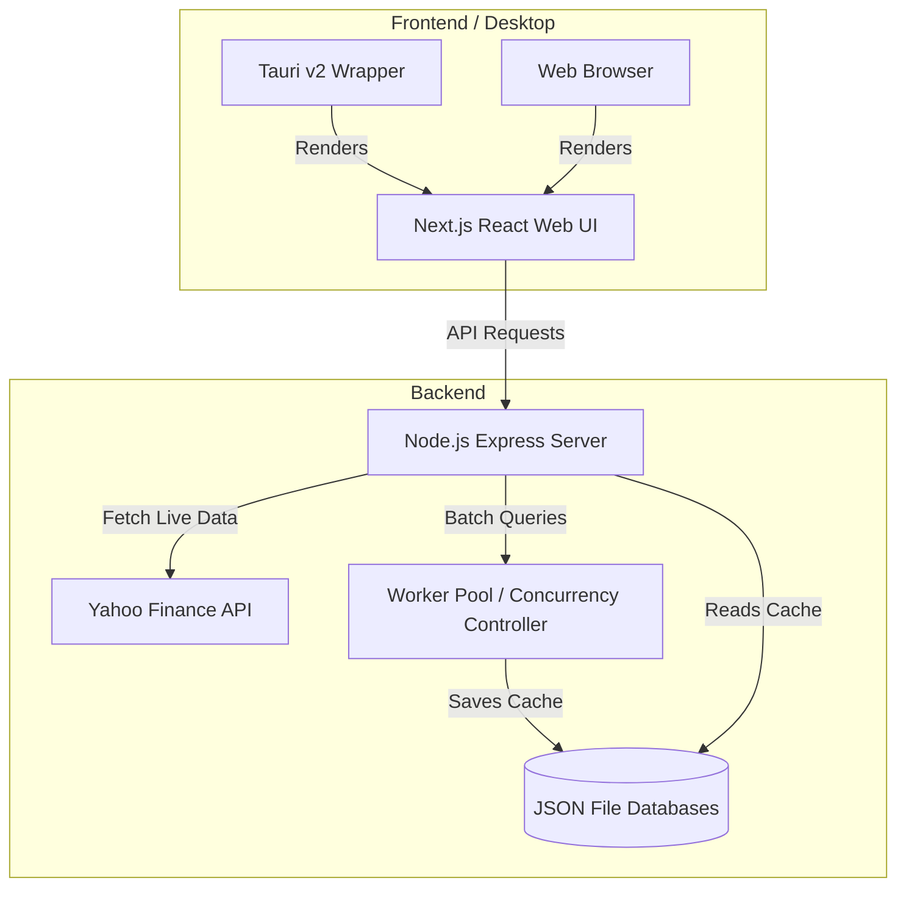
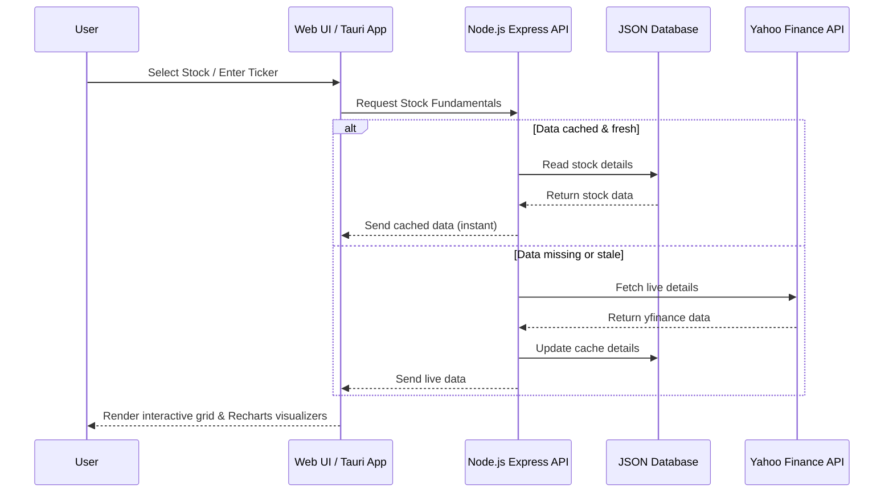

# 📊 Professional Investment Terminal & Desktop App

A professional-grade investment analyzer featuring both a lightweight Python GUI app and a state-of-the-art full-stack Javascript stock fundamental dashboard with a native Tauri v2 desktop wrapper. It is designed to retrieve, analyze, and visualize 17 core fundamental metrics for top global companies.

---

## 📐 1. Architecture

The project has two distinct client architectures sharing the same data sources:

### A. Full-Stack Web & Tauri Desktop Architecture (Recommended)
This architecture is structured for high-performance data processing, instant loading using local file caching, and modern desktop/web rendering:



### B. Lightweight Python Desktop Architecture
A standalone GUI client running locally with direct APIs connection:
* **UI**: `customtkinter` (Dark-mode responsive layout)
* **Data Fetcher**: `yfinance` directly querying Yahoo Finance API
* **Export Engine**: CSV and JSON local storage writing

---

## 🔄 2. Workflow



1. **Query & Data Retrieval**: The system extracts 17 key financial indicators categorized into four domains:
   - **Valuation**: Forward P/E, Industry P/E, Price/Sales, Enterprise Value/Sales
   - **Profitability**: ROE, ROIC, Gross Margin, EBIT Margin
   - **Financial Health**: Debt/Equity ratio, Current Ratio, Beta (Volatility), Shares Outstanding
   - **Growth & Cash Flow**: EPS Forward, EPS Growth 5Y CAGR, Free Cash Flow (FCF), Tax Rate
2. **Worker Pool Batch Scraping**: The Node.js backend contains a concurrency worker pool that schedules queries for the Top 500/1000 global companies without hitting API rate limit blocks.
3. **Data Filtering & Audit**: Users can apply numeric range boundaries (e.g. ROIC > 15%, P/E < 20) and sort through a double-scrollable matrix.

---

## 🛠️ 3. Tool Techstack

### Web / Tauri Application Stack
* **Frontend UI**: React, Next.js (App Router), TailwindCSS, Recharts (Data Visualizations), Lucide React (Icons).
* **Backend API**: Node.js, Express, `yahoo-finance2`.
* **Desktop Wrapper**: Tauri v2, Rust toolchain.
* **Build Tools**: Turbopack, npm scripts.

### Python Desktop App Stack
* **Language**: Python 3.8+
* **GUI Framework**: `customtkinter`, `tkinter`.
* **API Connector**: `yfinance` (Yahoo Finance library), `pandas`.
* **Exporting**: `openpyxl` (Excel output support).

---

## 🗂️ 4. Project Structure

```
invest-1/
├── backend/                       # Node.js Express Server
│   ├── server.js                  # Main API server entry point
│   ├── retriever.js               # Concurrency fetching / caching library
│   ├── scraper.js                 # Scraper utilities
│   ├── package.json               # Backend dependencies
│   └── *.json                     # Cached stock dataset stores
├── frontend/                      # React / Next.js Web UI
│   ├── src/                       # App Router pages, components, styles
│   ├── src-tauri/                 # Tauri v2 Rust project source
│   ├── next.config.ts             # Next.js configuration
│   ├── package.json               # Frontend dependencies
│   └── tailwind.config.ts         # Dark theme style config
├── app.py                         # Python CustomTkinter GUI main application
├── invest_retriever.py            # Python yfinance fetching script
├── main.py                        # Python command line test runner
├── requirements.txt               # Python package dependencies
└── package.json                   # Root master-scripts packages config
```

---

## 🚀 5. How to Setup

### Option A: Running the Professional Web UI & Tauri Desktop App

#### 1. System Dependencies (Tauri Desktop App only)
For building the Tauri desktop wrapper, you will need the Rust toolchain installed:
```bash
curl --proto '=https' --tlsv1.2 -sSf https://sh.rustup.rs | sh
```

#### 2. Install Dependencies
Run from the repository root:
```bash
npm run install:all
```

#### 3. Run Development Servers
Open two terminal windows:

* **Terminal 1: Start the Backend Server** (runs on port `4000`)
  ```bash
  npm run dev:backend
  ```
* **Terminal 2: Start the Next.js Frontend** (runs on port `3000`)
  ```bash
  npm run dev:frontend
  ```

Once both servers are live, browse to **[http://localhost:3000](http://localhost:3000)**.

#### 4. Run as Standalone Desktop App
To build and run in desktop developer mode:
```bash
npm run dev:desktop
```
To compile a native release executable:
```bash
npm run build:desktop
```
The compiled executable binary will be generated under `frontend/src-tauri/target/release`.

---

### Option B: Running the Python Desktop Application

#### 1. Install System GUI packages (Linux Only)
```bash
# Debian / Ubuntu / Mint:
sudo apt-get update && sudo apt-get install -y python3-tk
# Fedora / RHEL:
sudo dnf install -y python3-tkinter
# Arch Linux:
sudo pacman -S tk
```

#### 2. Set Up Virtual Environment & Dependencies
```bash
python3 -m venv .venv
source .venv/bin/activate
pip install -r requirements.txt
```

#### 3. Launch GUI or CLI
* **Run GUI application**:
  ```bash
  python app.py
  ```
* **Run CLI query test**:
  ```bash
  python main.py TSLA
  ```
  *(Replace `TSLA` with any desired stock ticker)*
